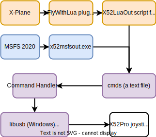

This program tries to replicate the functionality of [X52LuaOut](https://forums.x-plane.org/index.php?%2Ffiles%2Ffile%2F35304-x52luaout-winmaclin) with Microsoft Flight Simulator 2020. If you are proficient in Lua or C++, feel free to help out and send PRs. I’m not experienced in any of them, nor have much time, so my progress is slow.

The program can re-use the XML configuration files from X52LuaOut, but you have to replace the name of the datarefs with their MSFS equivalents called SimVars. See `default.xml` included with x52msfsout for examples.

The program is NOT user-friendly. I only developed the bare minimum functionality that I needed. You are welcomed to help out.

I have an X52 Pro, so I cannot support the non-pro version because I cannot test it.

X52LuaOut supports Windows, Linux, and Mac. This program currently only supports Windows. I know that MSFS can be started under Linux in Steam using Proton but I don’t know whether the SimConnect SDK works in Linux. I have zero information about Mac.

# Installation

Download the latest x52msfsout Release from the right hand side of this page.

Download [WASimModule-v1.2.0.0.zip](https://github.com/mpaperno/WASimCommander/releases/download/1.2.0.0/WASimModule-v1.2.0.0.zip), extract it and copy the `wasimcommander-module` folder to your MSFS [community folder](https://docs.flightsimulator.com/html/Introduction/#community). This module is needed to do special things in MSFS like executing calculator code. It is similar to FSUIPC, but it is free.

# Saitek / Logitech DirectOutput service (aka SaiDOutput)

When you install the Saitek / Logitech X52 Pro driver, it installs a Service. This is responsible to send commands to the joystick when you use the "X52 Professional H.O.T.A.S." application. When x52msfsout starts, it stops this service otherwise access to some joystick parameters would be blocked by the Service.

## Change the Service permissions

Normally, x52msfsout could only stop the Service if you run it from an Administrative Prompt. To save you from having to open an Administrative Prompt every time, do the following. It is enough to do this once:

- Open an Administrative Prompt.
- Issue the command `sc.exe sdshow saidoutput`.
- The output has two parts, the first part starts with D: and the second part with S:.
- Copy the output of the command, and insert `(A;;RPWPCR;;;BU)` to the end of the first part, just before S:.
- Issue the command `sc.exe sdset saidoutput XXX` where XXX is the appended output from the previous step. On my computer the full command is `sc.exe sdset saidoutput D:(A;;CCLCSWRPWPDTLOCRRC;;;SY)(A;;CCDCLCSWRPWPDTLOCRSDRCWDWO;;;BA)(A;;CCLCSWLOCRRC;;;IU)(A;;CCLCSWLOCRRC;;;SU)(A;;RPWPCR;;;BU)S:(AU;FA;CCDCLCSWRPWPDTLOCRSDRCWDWO;;;WD)`.
- The system should reply with the message `[SC] SetServiceObjectSecurity SUCCESS`.
- You can close the Administrative Prompt.

After this, you won't need to run x52msfsout from an Administrative Prompt.

The meaning of `(A;;RPWPCR;;;BU)` is `A`: Allow, `RP`: Read Properties, `WP`: Write Properties, `CR`: Control Service (includes start/stop), `BU`: Built-in users.

## Restoring the Service

x52msfsout will only start sucessfully, if it could stop the DirectOutput service. When x52msfsout stops, it will try to restart the service, but this may fail, for example, if x52msfsout crashes and does not have a chance to restart the service. In this case do the following:

- Open a Command Prompt.
- Issue the command `sc.exe query saidoutput`.
- If in the output you see `STATE: 1 STOPPED` then issue the command `sc.exe start saidoutput`.
- If in the output you see `STATE: 4 RUNNING` then the service is running and no action is necessary.

# XML configuration files

After installation, you have to prepare XML configuration file(s). They determine how your joystick will react to events in MSFS  (including shifted buttons and Mode 1-3). You can define your own MFD pages, LED states with custom blinking patterns, etc. The included `default.xml` file has example configurations for all tags which are currently supported.

x52msfsout only validates whether your file is well-formed XML, but it does not check whether mandatory attributes are missing and things like that. So it is your responsibility to create the XML according to the X52LuaOut Manual, otherwise x52msfsout will likely not work or will crash.

To create these files, your primary documentation is the X52LuaOut Manual (see link at the top of this README). But x52msfsout introduced some changes which are described below.

## X52LuaOut configuration file support

In the included `default.xml` file you can find example configuration for all tags which are currently supported:

- [x] \<master\> fully supported, with \<target id=mfd\> and \<target id=led\>.

- [x] \<shift_states\> fully supported.

- [ ] \<assignments\>, clear_all attribute not supported. Not all types of \<button\> tags are supported inside \<assignments\>:
  - [x] \<button type="trigger_pos"\> fully supported. Can handle dataref (SimVar in MSFS), command (inputevent in MSFS), and MSFS calculator code.
  - [x] \<shifted_button\> fully supported with dataref and command attributes.
  - [ ] \<button type="trigger_neg"\>
  - [ ] \<button type="hold"\>
  - [ ] \<button type="toggle"\>
  - [ ] \<button type="repeater"\>
- [x] \<sequences\> fully supported.
- [x] \<indicators\> fully supported.
  - [x] \<led\> fully supported.
    - [x] \<state\> fully supported. Also supports a new "delta" attribute, which determines the minimum change after which MSFS notifies us. Useful for values which constantly fluctuate, such as RPM.
- [ ] \<mfd\> support is planned.

## Differences between X-Plane datarefs and MSFS SimVars

- SimVar names do not look like folder paths (no / signs).
- They are not case sensitive, they can be written in any case.
- They can have spaces.

## SimVar syntax

You use SimVar names in the dataref attributes.

- Some of them have an index, for example, to identify throttle 1 and throttle 2. Add the index to the end of the name separated by a colon like this: `LIGHT GLARESHIELD:1`.
- Every SimVar must have a unit (of measurement)! Add this at the very end of the name separated by a percentage sign like this: `LIGHT GLARESHIELD:1%number`. The default unit for each SimVar can be found in the [official SimVar documentation](https://docs.flightsimulator.com/html/Programming_Tools/SimVars/Simulation_Variables.htm). Also see the [docs on Simulation Variable Units](https://docs.flightsimulator.com/html/Programming_Tools/SimVars/Simulation_Variable_Units.htm) to see how SimVars can be converted to different units. You have to take this into account when putting together your XML because the same SimVar can return different values depending on what unit you specify. Perferably use [SimvarWatcher-MFWASM](https://github.com/rmaryan/SimvarWatcher-MFWASM) first to test what min and max values MSFS returns for a certain unit.

## Where can I find SimVar names?

- Look it up in the [official SimVar documentation](https://docs.flightsimulator.com/html/Programming_Tools/SimVars/Simulation_Variables.htm).
- Enable Development mode in MSFS in Options → General Options → Developers. During a flight, from the top Devmode menu select Tools → Behaviors. On the LocalVariables tab you can monitor many SimVars and see when they change and to what value. Optionally, you can check „Show only vars set by plane” to only monitor values defined in the current aircraft. Then use these names in the XML.
- Use [SimvarWatcher-MFWASM](https://github.com/rmaryan/SimvarWatcher-MFWASM) to test SimVar values.

## What are InputEvents?

You use InputEvents in command attributes. They command the plane to do something.

To find available InputEvents for a given aircraft, enable Development mode in MSFS in Options → General Options → Developers. During a flight, from the top Devmode menu select Tools → Behaviors. At the top of the page select AIRCRAFTNAME_INTERIOR.XML (for example CESSNA152_INTERIOR.XML) from the dropdown. Then on the InputEvents tab you can drill down into several event groups. At the lowest level everything written in light blue are InputEvent names, like ELEV_TRIM_UP or ELEVATOR_TRIM_SET. Find the documentation of the Behaviors tool [on this page](https://docs.flightsimulator.com/html/Developer_Mode/Menus/Tools/Behaviors_Debug.htm).

## What is calculator code?

This is a very powerful new feature, specific to MSFS, only available in x52msfsout. Calculator codes are small "scripts" which can read, manipulate, modify simulator values. They are written in [RPN notation](https://docs.flightsimulator.com/html/Additional_Information/Reverse_Polish_Notation.htm). They are normally used in MSFS XML configuration files but with x52msfsout and the WASimCommander module you can use it with your X52 Pro.

Currently you can use the `calculator_code` attribute in \<button\> tags.

Make sure to replace > with \&gt; and < with \&lt; in calculator code.

There is a page called [HubHop](https://hubhop.mobiflight.com/presets/) where you can find a lot of RPN example code for your calculator code scripts.

Here is [another useful page](https://github.com/MobiFlight/MobiFlight-Connector/wiki/MSFS2020-RPN-Tips-and-Tricks) which has various RPN examples for different simulator situations.

## Joystick button numbers in MSFS

When specifying the button numbers for the \<button\> tag and elsewhere, use the same button number that you see in MSFS Control Options.

Find an easy to understand overview of different buttons [on this page](./X52 Pro Buttons Overview/X52 Pro Buttons Overview.md)

# Usage

After you have completed the installation steps and you have an XML configuration file ready, do the following.

Plug in your X52 Pro.

Start MSFS.

Start your flight.

Start a command prompt and change the directory to where x52msfsout.exe is. Start x52msfsout.exe and make sure you specify the required `xmlconfig` command line option (short form is `x`). This tells the program which XML config file to use (you can have different files for different aircrafts). The XML files are not opened automatically based on the aircraft’s name like in X52LuaOut.

You can also use the following optional command line options:
- `h` or `help` displays all possible options. You will see the same if you start x52msfsout without any options.
- `l` or `logtofile` makes x52msfsout to log not only to console but to a file `x52msfsout_log.txt`, as well. The file is placed next to x52msfsout.exe and contains additional details compared to the console log. File is never deleted, only appended.
- `d` or `logdebug` expand the log with additional messages which happen infrequently.
- `t` or `logtrace` expand the log with additional messages which happen frequently.

# Contributing

Since I’m not very experienced in Lua or C++, your help is much appreciated. The task is to rewrite the X52LuaOut script (written in Lua) into C++ using SimConnect and WASimCommander. The good news is the program’s skeleton is ready. You don’t have to start from scratch. The aim is to support X52LuaOut XML config files with minimal modifications.

## Development environment

The project was created using Visual Studio 2022.

To compile it yourself, [set up vcpkg](https://learn.microsoft.com/hu-hu/vcpkg/get_started/get-started-msbuild?pivots=shell-cmd) and install the MSFS SDK. If you need help setting up your dev environment, open an Issue and I can hopefully help.

This repository already includes the dependencies from [WASimCommander_SDK-v1.2.0.0](https://github.com/mpaperno/WASimCommander/).

# Architecture

The following diagram shows how different parts of x52msfsout connect together.

# Flowchart

# Known bugs

- Future improvement: Execute calculator code „as either a data request or a registered event” as suggested [here](https://wasimcommander.max.paperno.us/class_w_a_sim_commander_1_1_client_1_1_w_a_sim_client.html#a289fcb4566f6f44714412e8e27bbd361).
- Nice to have: MapClientEventToSimEvent does not allow re-use of Event IDs. Workaround already implemented. Bug reported.

# Online presence, support

Main discussion thread on FlightSimulator forum: https://forums.flightsimulator.com/t/x52msfsout-an-app-to-control-leds-and-mfd-on-the-saitek-logitech-x52-pro-joystick/648249  You can post in this thread if you don't know how to create an Issue on GitHub.

This program has been announced at https://forums.flightsimulator.com/t/controlling-leds-and-mfd-on-the-saitek-logitech-x52-pro-and-non-pro-joystick/223066

and at https://forums.x-plane.org/index.php?%2Ffiles%2Ffile%2F35304-x52luaout-winmaclin

# TODO

Announce this program at https://flightsim.to/file/5559/saitek-x52-pro-dynamic-led-plugin
