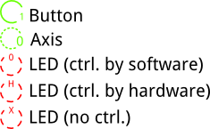
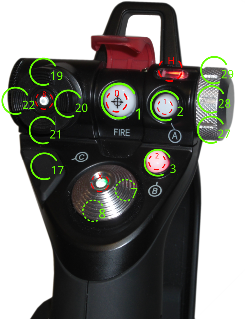
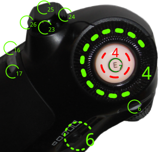

# X52 Pro Buttons Overview

This page informs about the axis and buttons of X52 Pro and about the LED numbers and non controlable LEDs.

This page is a [copy of this page](https://hacks4ros.github.io/h4r_x52_joyext/doc/doxygen/d3/d14/x52_general.html).

When using the numbers in MSFS and x52msfsout, **add 1 to all numbers**!

## Legend

On the pictures multiple types of markers can be found. Their meaning is shown in the following picture.

# Joystick

This section takes a closer look on the joystick part of the X52 Pro.

## Joystick Head

| Button | Description |
| ------ | ----------- |
| 1      | Button Fire |
| 2      | Button A    |
| 3      | Button B    |
| 17     | Button C    |
| 19     | POV2 Up     |
| 20     | POV2 Right  |
| 21     | POV2 Down   |
| 22     | POV2 Left   |
| 27     | MODE 1      |
| 28     | MODE 2      |
| 29     | MODE 3      |

| Axis | Description           |
| ---- | --------------------- |
| 7    | POV 1 Pseudo Axis (X) |
| 8    | POV 1 Pseudo Axis (Y) |

| LED  | Description                                                  |
| ---- | ------------------------------------------------------------ |
| 0    | LED FIRE can be switched on and off, but changes color only, when safe switch is up(red) or down(green) |
| 1    | LED of Button A                                              |
| 2    | LED of Button B                                              |
| H    | LED controlled by MODE Switch (Button 27-29)                 |
| X    | LED never changes color, only it's brightness is controlled by the global brightness |

## Joystick Side

| Button | Description                                                  |
| ------ | ------------------------------------------------------------ |
| 0      | Gun Button Step 1                                            |
| 14     | Gun Button Step 2 (Gunbutton Step 1 will always be pressed too!) |
| 5      | Switch Button                                                |

| Axis | Description |
| ---- | ----------- |
| 0    | Main X Axis |
| 1    | Main Y Axis |
| 5    | Main Z Axis |

## Joystick T-Buttons

| Button | Description |
| ------ | ----------- |
| 8      | T Button 1  |
| 9      | T Button 2  |
| 10     | T Button 3  |
| 11     | T Button 4  |
| 12     | T Button 5  |
| 13     | T Button 6  |

# Throttle

In this section there is information about the throttle part.

## Throttle Top

| LED  | Description  |
| ---- | ------------ |
| 4    | LED Button E |

| Button | Description           |
| ------ | --------------------- |
| 4      | Button E              |
| 6      | Button D              |
| 16     | Scrollwheel forward   |
| 17     | Scrollwheel backward  |
| 23     | Throttle POV backfard |
| 24     | Throttle POV right    |
| 25     | Throttle POV forward  |
| 26     | Throttle POV left     |

| Axis | Description       |
| ---- | ----------------- |
| 4    | Throttle Rotary 1 |
| 6    | Throttle Slider   |

## Throttle Side

| LED  | Description  |
| ---- | ------------ |
| 3    | LED Button D |
| 9    | LED Button I |

| Button | Description  |
| ------ | ------------ |
| 4      | Button E     |
| 6      | Button D     |
| 15     | Button Mouse |
| 30     | Button I     |

| Axis | Description       |
| ---- | ----------------- |
| 3    | Throttle Rotary 2 |
| 6    | Throttle Slider   |
| 9    | Mouse X           |
| 10   | Mouse Y           |

# Multi Function Display

| Button | Description                                                  |
| ------ | ------------------------------------------------------------ |
| 31     | Button Scrollwheel1 Toggle Time/Stopwatch (usage by user app. not recommended switches Clock-Stopwatch Mode) |
| 32     | Button Start/Stop (usage by user app. not recommended controls Stopwatch) |
| 33     | Button Reset (usage by user app. not recommended resets Stopwatch) |
| 34     | Scrollwheel1 Page up. (usage by user app. not recommended, timezone setting) |
| 35     | Scrollwheel1 Page down. (usage by user app. not recommended, timezone setting) |
| 36     | Scrollwheel2 Up                                              |
| 37     | Scrollwheel2 Down                                            |
| 38     | Button Scrollwheel2                                          |

| Display Element        | Description                                                  |
| ---------------------- | ------------------------------------------------------------ |
| Clock/Stopwatch Status | Shows if the current mode is time(if set) or stopwatch       |
| Clock/Stopwatch        | Shows the current time (if set) or stopwatch value           |
| AM/PM                  | Shows at morning or past morning if time is set and not in 24 hour mode |
| Date                   | Shows the current date (if set)                              |
| Character Display      | Has 3 lines with 16 chars each                               |
| Mode Switch Status     | Shows the current state of mode selector (button 27-29)      |